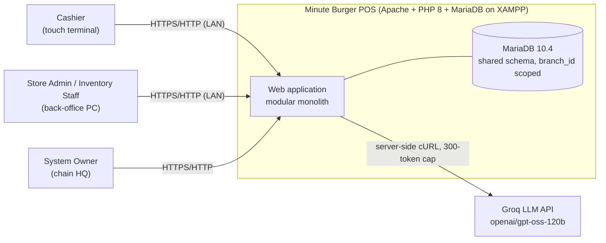
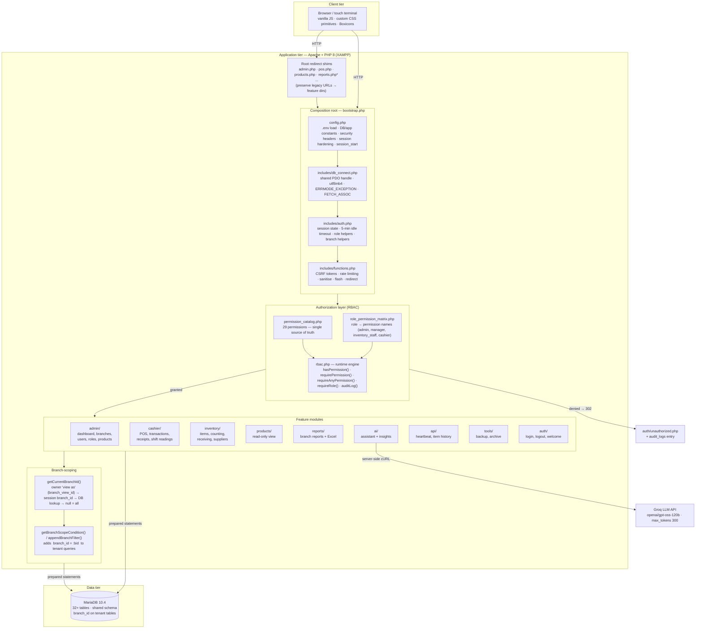
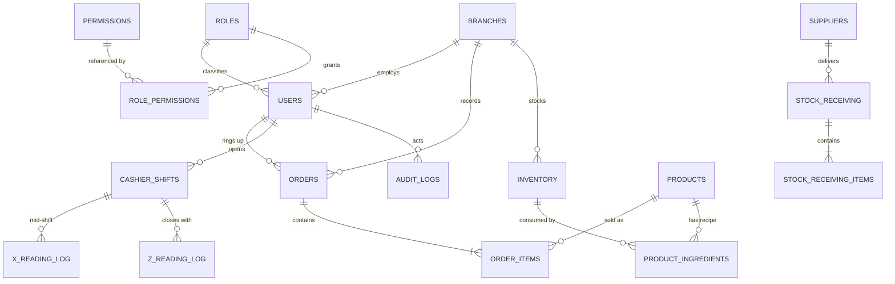
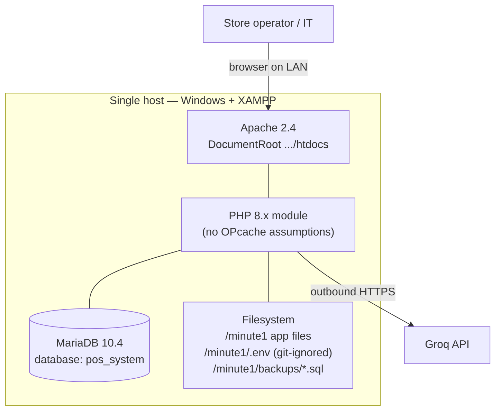

# Minute Burger POS — Software Architecture Document

**Prepared for:** Capstone / Thesis Defense Panel
**System:** Minute Burger POS — Point-of-Sale & Inventory Management System
**Architecture style:** Modular monolith, page-per-request PHP application on a shared-schema multi-tenant database
**Document status:** Draft for defense
**Version:** 1.0
**Date:** 2026-08-30
**Author:** _(candidate name)_ — Development team

---

## Document control

| Field | Value |
|---|---|
| Technology stack | PHP 8.0+ (developed against XAMPP-bundled PHP 8.2), Apache 2.4, MariaDB 10.4, vanilla JavaScript, hand-rolled CSS |
| Deployment target | Stock XAMPP on a single Windows host (store back-office PC or modest VPS); served at `http://localhost/minute1/` |
| External dependencies | Groq LLM API (optional; AI assistant only). No Composer, no npm, no build step. |
| Codebase size | **42,221 lines** total: 36,268 lines of PHP across 95 files, 4,709 lines of CSS (4 files), 1,244 lines of JavaScript (3 files). See Appendix E for the full breakdown. |
| Database size | 32 tables in the baseline schema dump `pos_system (2).sql`; RBAC and rate-limiting migrations add `permissions`, `role_permissions`, `audit_logs` and `login_rate_limits` |
| Repository conventions | Documented in `CLAUDE.md` at the repository root |

---

## Table of contents

0. [Executive summary](#0-executive-summary)
1. [System context](#1-system-context)
2. [Requirements](#2-requirements)
3. [Architecture overview](#3-architecture-overview)
4. [Component and module breakdown](#4-component-and-module-breakdown)
5. [Runtime view](#5-runtime-view)
6. [Data architecture](#6-data-architecture)
7. [Architecture Decision Records](#7-architecture-decision-records)
8. [Security architecture](#8-security-architecture)
9. [Deployment view](#9-deployment-view)
10. [Known limitations and technical debt](#10-known-limitations-and-technical-debt)
11. [Risks and recommended mitigations](#11-risks-and-recommended-mitigations)
12. [Defense Q&A preparation](#12-defense-qa-preparation)
- [Appendix A — Permission catalog](#appendix-a--permission-catalog-29-permissions)
- [Appendix B — Role/permission matrix](#appendix-b--rolepermission-matrix)
- [Appendix C — Table inventory](#appendix-c--table-inventory)
- [Appendix D — Glossary](#appendix-d--glossary)
- [Appendix E — Codebase metrics](#appendix-e--codebase-metrics-measured)
- [Appendix F — Word version](#appendix-f--word-version)

---

## 0. Executive summary

Minute Burger POS is a web-based point-of-sale and inventory system for a multi-branch quick-service restaurant. It is built as a **modular monolith**: one PHP application, organised into feature directories, executing one script per HTTP request, backed by a single MariaDB database.

The architecture is defined by four deliberate design pillars:

1. **A single composition root — the bootstrap chain.** Every page loads `bootstrap.php`, which wires configuration, the database connection, authentication and shared helpers in a fixed order. There is exactly one place where the application is assembled.
2. **Permission-based access control (RBAC).** Authorization is expressed as 29 named permissions, mapped to roles through a declared matrix, and enforced at runtime by a small engine. Pages gate themselves with `requirePermission('...')` rather than checking roles directly.
3. **Shared-schema multi-tenancy by branch.** Every tenant-scoped row carries a `branch_id`. Access is filtered through one helper so branch isolation is not re-implemented per page. The system owner can transparently "view as" any branch.
4. **No framework, by constraint.** The system must install on unmodified XAMPP with no build tooling. The project therefore implements the *subset* of framework features it actually needs — routing by direct file access, prepared-statement data access, a permission engine, CSRF helpers and a migration convention — and nothing more.

The system is functionally complete for its domain: POS with shift management and BIR-style X/Z readings, inventory with receiving/counting/recipes, multi-branch reporting with Excel export, user and role administration, an audit trail, database backups, and an optional AI assistant over business data.

This document presents the requirements, the architecture and its diagrams, the reasoning behind the major decisions (as ADRs), the security design, and an honest register of known limitations and risks with mitigations — framed so the panel can see that each shortcut was a **considered trade-off with a remediation path**, not an oversight.

---

## 1. System context

### 1.1 Purpose and users

| Actor | Role name | Primary use |
|---|---|---|
| System Owner | `admin` | Chain-wide oversight: branches, users, roles, products, consolidated reports, backups, AI assistant. Implicitly holds every permission; can "view as" any branch. |
| Store Admin | `manager` | Runs one branch: products, inventory, staff (cashiers), branch reports, day-to-day operations. |
| Inventory Staff | `inventory_staff` | Stock receiving, physical counts, stock-movement history, low-stock handling for one branch. |
| Cashier | `cashier` | POS only: opens a shift, rings up sales, prints receipts, runs X/Z readings, views own transactions. |
| Branch Owner | `branch_owner` | **Label only** — see §10. Intended as a read-mostly branch stakeholder role; not yet provisioned with permissions. |
| Groq LLM API | external system | Answers natural-language questions about business data on behalf of the AI assistant. |

### 1.2 Context diagram



### 1.3 Business context and constraints

- **Domain:** Philippine quick-service restaurant chain. Financial controls follow local retail practice — per-shift **X-readings** (mid-shift running totals) and **Z-readings** (end-of-shift close), plus cash-drop logging.
- **Operating environment:** a store back-office PC running XAMPP, on a trusted store LAN, with non-developer operators. Installation must not require a terminal, a package manager or a build.
- **Timezone** is hard-set to `Asia/Manila` in `includes/db_connect.php`.
- **Budget:** zero software licensing. Every runtime component is open-source; the only external paid dependency (Groq) has a free tier and is optional.

---

## 2. Requirements

### 2.1 Functional requirements

| ID | Requirement | Realised by |
|---|---|---|
| FR-1 | **Authentication.** Users log in with a user ID and password; passwords stored as bcrypt hashes; session ID regenerated on login; idle sessions expire after 5 minutes; a deactivated or deleted account is force-logged-out on its next request. | `includes/auth.php` (`authenticateUser`, `checkUserStatus`), `auth/login.php`, `auth/logout.php` |
| FR-2 | **Authorization (RBAC).** 29 named permissions; four provisioned roles plus an owner super-user; per-user permission overrides; every protected page denies by default unless the current user holds the required permission. | `includes/permission_catalog.php`, `includes/role_permission_matrix.php`, `includes/rbac.php` |
| FR-3 | **Point of Sale.** Category-ordered product grid, cart building, order creation with computed totals/change, receipt generation. POS access requires an **active shift** for cashiers. | `cashier/pos.php`, `cashier/receipt.php`, `receipt.php` |
| FR-4 | **Shift management.** Start shift; mid-shift X-reading; end-of-shift Z-reading; cash-drop logging. | `start_shift.php`, `x_reading.php`, `z_reading.php`, tables `cashier_shifts`, `x_reading_log`, `z_reading_log`, `cash_drop_log` |
| FR-5 | **Inventory management.** Item CRUD and stock levels; stock receiving/deliveries; physical counts (back-office and cashier variants); stock-movement history; low-stock alerts; restock requests; batch tracking; recipe-driven consumption. | `inventory/`, `includes/inventory_functions.php`, tables `inventory*`, `stock_receiving*`, `restock_requests`, `product_ingredients`, `product_inventory_usage` |
| FR-6 | **Product management.** Product and recipe CRUD for privileged roles; read-only product view for others. | `admin/products.php`, `admin/product_ingredients.php`, `products/` |
| FR-7 | **Multi-branch operations.** Branch CRUD; branch-scoped data isolation; owner "view as branch"; branch-to-branch comparison. | `admin/branches.php`, `admin/switch_branch.php`, `getCurrentBranchId()`, `branch_id` columns |
| FR-8 | **Reporting.** Sales and financial reports, branch-scoped, with Excel export; a separate owner dashboard view. | `reports/reports.php` (branch + export), `admin/reports.php` (owner), `reports.php` (role-aware shim) |
| FR-9 | **Transaction history.** Searchable, date-filtered, paginated order history, branch-scoped. | `transactions.php` (root), `cashier/transactions.php` |
| FR-10 | **User & cashier administration.** User CRUD; role assignment constrained by the actor's own role (only the owner may assign non-cashier roles). | `admin/users.php`, `admin/cashiers.php`, `getAssignableRoles()` |
| FR-11 | **AI assistant.** Natural-language Q&A over assembled business context via Groq; dashboard insights; exposed as a floating widget for privileged users. | `ai/ai_helper.php`, `ai/ai_endpoint.php`, `includes/dashboard_ai.php`, `admin/includes/ai_chatbot_widget.php` |
| FR-12 | **Audit logging.** Record login, unauthorized-access attempts and sensitive actions with actor, action, target, result, IP and user-agent. | `auditLog()` in `includes/rbac.php`, table `audit_logs`; permission changes in `permission_logs` |
| FR-13 | **Backup & archive.** Create/download/delete database backups (token-guarded download); archive and restore products and inventory items. | `tools/`, `backup.php`, `archive.php`, `includes/backup_functions.php` |
| FR-14 | **JSON service endpoints.** Lightweight endpoints for the client: session heartbeat, item history lookup. | `api/`, `heartbeat.php`, `get_item_history.php` |

### 2.2 Non-functional requirements

| ID | Attribute | Target | How addressed today | Known gap (see §10–§11) |
|---|---|---|---|---|
| NFR-1 | **Security** | OWASP-aligned defenses for a web app handling money and staff data | Prepared statements, CSRF tokens, output encoding, CSP + anti-clickjacking headers, session-cookie hardening, IP-keyed login rate limiting, bcrypt, audit trail | CSP allows `'unsafe-inline'`; no `cookie_secure`/HSTS at the app layer; rate limiting only on login |
| NFR-2 | **Deployability / portability** | Install on unmodified XAMPP with no build step; "copy files, import SQL, set `.env`" | No framework, no Composer/npm; single `.env`; SQL dump + migration convention | No schema-version table; base dump + migrations must be applied in the right order |
| NFR-3 | **Maintainability** | A new contributor is productive after reading `bootstrap.php`, `config.php`, `rbac.php` and one feature page | Feature-per-directory layout; single sources of truth for permissions and the role matrix; `CLAUDE.md` documents the entry chain and every known quirk | Conventions are tribal knowledge; no `CONTRIBUTING.md`; no tests |
| NFR-4 | **Usability / responsiveness** | Touch-friendly POS; back-office usable on desktop; standard breakpoints 480/768/1024/1280 | Shared CSS primitives (`assets/css/layout.css`, `l-`/`u-` classes); touch stylesheet; hover-lift neutralised on touch | Two transaction pages carry divergent styling |
| NFR-5 | **Performance** | A page renders a bounded set of indexed queries within interactive latency at store load (a few terminals per branch; tens of thousands of orders/branch/year) | Page-per-request, no heavy runtime; POS grid and history paginated; branch scoping narrows every large query | `users.last_activity` is written on **every** authenticated request (write amplification) |
| NFR-6 | **Reliability / recoverability** | On-demand recovery; graceful failure | On-demand DB backups; audit + X/Z logs support reconstruction; friendly message on DB-connect failure; rate-limit table self-heals if its migration is missing | Single DB, single host — no HA; backups are operator-initiated |
| NFR-7 | **Data integrity** | Orders are atomic and uniquely numbered | Unique constraint on order number (migration 006); FK from `users.role_id` to `roles.id`; transactional order writes | Some branch filters are built by integer-cast string interpolation rather than bound parameters (safe, but inconsistent) |
| NFR-8 | **Observability** | Enough signal to investigate an incident | `error_log` for exceptions; `audit_logs`, `permission_logs`; X/Z reading logs | No centralised log aggregation or metrics |
| NFR-9 | **Cost** | Zero licensing | Fully open-source stack; Groq optional and free-tier | AI feature egresses aggregated business figures to a third party |
| NFR-10 | **Auditability / compliance** | Retail cash-control practice (X/Z readings); traceable admin actions | Per-shift X/Z logs; append-only audit log with actor + IP + UA | Audit log is not cryptographically tamper-evident |

### 2.3 Constraints

- **C-1** No web framework and no build step (institutional and deployment-simplicity mandate). Drives ADR-001.
- **C-2** Windows-first; XAMPP; `Asia/Manila` timezone assumed.
- **C-3** One MariaDB database; shared-schema multi-tenancy (ADR-003).
- **C-4** No CI/CD and no automated test suite; verification is manual browser testing.

### 2.4 Assumptions

- Deployment is on a **trusted LAN**; the store network is not adversarial, and TLS is terminated by the deployment (reverse proxy) or the app runs on `localhost`.
- **Low write concurrency** — a handful of concurrent terminals per branch.
- A single database server is sufficient for the foreseeable operating horizon.

---

## 3. Architecture overview

### 3.1 Style and rationale

The system is a **modular monolith** using the classic **page controller / page-per-request** model of "plain PHP": Apache maps a URL to a `.php` file, the script runs top-to-bottom, emits HTML (or JSON), and exits. There is no long-lived process and no shared in-memory state between requests — every request rebuilds its world from `bootstrap.php` and the session.

This is a good fit for the constraints: it is trivial to deploy, trivial to reason about (one request = one file), and scales horizontally by simply running more identical PHP hosts against the same database.

### 3.2 The primary architecture diagram

The diagram below shows the four pillars in one view: the **bootstrap chain** (composition root), the **RBAC layers**, **branch-scoping**, and the **feature modules**.



### 3.3 The bootstrap chain (composition root)

`bootstrap.php` is four lines and is the only place the application is assembled:

```php
require_once __DIR__ . '/config.php';              // 1. env, constants, headers, session
require_once __DIR__ . '/includes/db_connect.php'; // 2. shared $pdo
require_once __DIR__ . '/includes/auth.php';       // 3. session/auth/role/branch helpers (pulls in rbac.php)
require_once __DIR__ . '/includes/functions.php';  // 4. CSRF, rate limiting, misc helpers
```

Order is load-bearing:

1. **`config.php`** loads `.env` (real environment variables win over the file), defines `DB_*`, `GROQ_API_KEY`, `APP_*` and path constants, sends the security headers (`Content-Security-Policy`, `X-Frame-Options`, `X-Content-Type-Options`, `Referrer-Policy`, `X-XSS-Protection`), hardens the session (`cookie_httponly`, `cookie_samesite=Lax`, `use_strict_mode`, `use_only_cookies`) and calls `session_start()`. Everything downstream can assume a configured, header-sent, session-started request.
2. **`includes/db_connect.php`** creates the shared `$pdo` (charset `utf8mb4`, `ERRMODE_EXCEPTION`, default `FETCH_ASSOC`) and sets the timezone. A connection failure ends the request with an operator-friendly message rather than a stack trace.
3. **`includes/auth.php`** provides `isLoggedIn()`, the `isOwner()/isManager()/isCashier()/isInventoryStaff()/isBranchOwner()` role helpers, the branch helpers (`getCurrentBranchId()`, `getCurrentBranchName()`, `getBranchScopeCondition()`, `appendBranchFilter()`), and `requireAuth()`. It also **auto-runs `checkUserStatus()`** at include time for an already-logged-in session, so the 5-minute idle timeout and the "account still active?" check are enforced even on a page that forgets to call `requireAuth()` explicitly. It `require`s `rbac.php`.
4. **`includes/functions.php`** adds CSRF helpers (`getCsrfToken`, `validateCsrfToken`, `csrfField`, `requireCsrfToken`), the rate limiters, `sanitizeInput()`, flash messages and a header-injection-safe `redirectTo()`.

> **Precision note for the panel:** the *intent* is that every page goes through `bootstrap.php`. In practice a few pages (`cashier/pos.php`, root `transactions.php`) `require` the same includes individually instead. The effect is identical; the inconsistency is listed as debt in §10.

### 3.4 The RBAC layers

Authorization is three files with one job each:

| Layer | File | Responsibility |
|---|---|---|
| **Catalog** | `includes/permission_catalog.php` | The canonical list of 29 permission names, each with a label, description and category. Nothing else defines a permission name. |
| **Matrix** | `includes/role_permission_matrix.php` | The default mapping of role → permission names. `admin` is defined as `array_keys(catalog)` (everything). `manager`, `inventory_staff` and `cashier` list their grants explicitly. |
| **Engine** | `includes/rbac.php` | Runtime checks and enforcement: `hasPermission()`, `hasAnyPermission()`, `requirePermission()`, `requireAnyPermission()`, `requireRole()`, plus `denyAccess()` and `auditLog()`. |

**Resolution order** (in `loadUserPermissions()`): if the role is `admin`, grant the entire catalog. Otherwise take the grants from the database (`role_permissions` joined to `permissions`), falling back to the static matrix if the DB has no mapping, then **union in any per-user overrides** stored as a JSON boolean map in `users.permissions`. The resulting flat list is cached in `$_SESSION['permissions']`.

**Freshness:** `checkUserStatus()` re-runs `loadUserPermissions()` on every authenticated request, so a role edit or permission change takes effect on the user's **next page load**, not their next login.

**Enforcement pattern** — every protected page starts with a one-liner:

```php
requirePermission('pos_access');      // deny (302 + audit) unless the session holds this permission
```

Role helpers (`isOwner()` etc.) still exist and are used for *branching UI* and for the owner's cross-branch privileges, but **feature gating goes through permissions**, per the project convention.

### 3.5 Branch-scoping (multi-tenancy)

```mermaid
flowchart TD
    Q{"isOwner() AND<br/>session branch_view_id set?"}
    Q -->|yes| V["scope = branch_view_id<br/>owner is 'viewing as' a branch"]
    Q -->|no| R{"session branch_id set?"}
    R -->|yes| S["scope = session branch_id"]
    R -->|no| T{"session user_id set?"}
    T -->|yes| L["scope = SELECT branch_id FROM users WHERE id = ?"]
    T -->|no| N["scope = null<br/>owner sees ALL branches"]
    V --> W
    S --> W
    L --> W
    N --> W["getBranchScopeCondition(alias)"]
    W --> X["appendBranchFilter(&#36;sql): append<br/>'AND alias.branch_id = &lt;scope&gt;'  (or add WHERE)"]
```



- Every tenant-scoped table carries a `branch_id`.
- Pages call **`getCurrentBranchId()`** rather than reading `$_SESSION['branch_id']`, because that helper also honours the owner's "view as" override (`branch_view_id`, set by `admin/switch_branch.php`) and falls back to a DB lookup.
- **`getBranchScopeCondition()` / `appendBranchFilter()`** centralise the SQL fragment so scoping logic is written once, not per query.
- **`requireBranchAccess($target_branch_id)`** blocks a non-owner from opening a page bound to another branch.
- The **owner** is the only role that sees across branches, and even then only globally (scope `null`) or through an explicit single-branch "view as".

### 3.6 Feature modules

See §4 for the full breakdown. The routing model is: **Apache serves the `.php` file directly.** Because the codebase was reorganised from flat root-level files into feature directories, most original root files (`admin.php`, `pos.php`, `products.php`, `ai_endpoint.php`, …) are now **redirect shims** (`header('Location: …')`) into the feature directories, preserving any bookmarked or hard-coded URLs. Two root files are **not** shims and hold live code — root `transactions.php` (a second, differently-styled implementation) and the role-aware `reports.php` shim (Owner → `admin/reports.php`, everyone else → `reports/reports.php`).

---

## 4. Component and module breakdown

### 4.1 Infrastructure / shared kernel (`includes/`, root config)

| Component | Files | Responsibility |
|---|---|---|
| **Configuration** | `config.php` | Load `.env`; define constants; send security headers; harden and start the session. |
| **Composition root** | `bootstrap.php` | Require config → db → auth → functions, in order. Single assembly point. |
| **Database access** | `includes/db_connect.php` (live), `includes/database.php` (unused singleton — see §10) | Create the shared `$pdo`; set error mode, fetch mode, charset, timezone. |
| **Authentication & session** | `includes/auth.php` | `authenticateUser()` (bcrypt verify, session regenerate, session priming, audit); `checkUserStatus()` (idle timeout, active-account check, permission refresh); `requireAuth()` and role/branch middleware. |
| **Authorization (RBAC)** | `includes/permission_catalog.php`, `includes/role_permission_matrix.php`, `includes/rbac.php`, `includes/permissions_quick.php` | Permission catalog, role matrix, runtime engine, and a convenience helper for quick checks. |
| **Shared helpers** | `includes/functions.php`, `includes/constants.php` | CSRF, rate limiting, input sanitisation, flash messages, safe redirect, currency formatting. |
| **Presentation shell** | `includes/header.php`, `includes/sidebar.php`, `cashier/header.php`, `assets/css/*` (`layout.css`, `admin.css`, `cashier-touch.css`), `assets/js/*` | Page chrome, navigation (permission-aware), shared responsive CSS primitives (`l-`/`u-` classes), touch behaviour. |
| **Domain helpers** | `includes/inventory_functions.php`, `includes/backup_functions.php`, `includes/dashboard_ai.php` | Inventory movement logic, backup file handling with token validation, dashboard insight assembly. |

> `includes/cashier_header.php` is **dead code** — nothing includes it; the live cashier chrome is `cashier/header.php` (§10).

### 4.2 Feature modules

| Module | Path | Responsibilities | Typical gate |
|---|---|---|---|
| **Admin / Owner** | `admin/` | Owner dashboard; branch CRUD and `switch_branch.php` ("view as"); user & cashier admin; role/permission editor; product & recipe management; owner reports; embedded AI chat. | `requirePermission('branches_manage' \| 'users_manage' \| 'products_manage' \| …)`; several pages `requireOwner()` |
| **Cashier / POS** | `cashier/` + `start_shift.php`, `x_reading.php`, `z_reading.php` | POS sale flow (shift-gated); transaction history; receipt rendering; shift open; X/Z readings; cash drop. | `requirePermission('pos_access' \| 'transactions_view')` |
| **Inventory** | `inventory/` | Item CRUD; stock receiving/deliveries; physical counts (back-office + cashier count); stock-movement history; suppliers; low-stock alerts; restock requests. | `requirePermission('inventory_view' \| 'inventory_manage' \| 'inventory_receive' \| 'inventory_count')` |
| **Products (read-only)** | `products/` | Product catalogue view for roles without `products_manage`. | `requirePermission('products_view')` |
| **Reports** | `reports/reports.php` (branch-scoped + Excel export), `admin/reports.php` (owner dashboard), `reports.php` (role-aware shim) | Sales/financial reporting; three parallel implementations for three audiences. | `requirePermission('reports_view')` |
| **AI assistant** | `ai/ai_helper.php`, `ai/ai_endpoint.php`, `includes/dashboard_ai.php`, `admin/includes/ai_chatbot_widget.php` | Assemble business context; call Groq (`openai/gpt-oss-120b`, `max_tokens=300`, `temperature=0.7`, 30-second cURL timeout) server-side; return an answer or a graceful degradation message. | Endpoint calls `requirePermission('reports_view')` |
| **API endpoints** | `api/`, `heartbeat.php`, `get_item_history.php` | Small JSON responses: session/POS heartbeat, item history lookup. | `requireAuth()` / permission as appropriate |
| **Tools** | `tools/`, `backup.php`, `archive.php`, `includes/backup_functions.php` | Create/list/delete DB backups; token-guarded backup download; archive & restore of products and inventory. | `requirePermission('backup_*' \| 'archive_*')` |
| **Auth pages** | `auth/login.php`, `auth/logout.php`, `auth/welcome.php`, `auth/unauthorized.php` | Login form (+ CSRF + rate limiting); logout; post-login splash; access-denied page (target of `denyAccess()`). | public / `requireAuth()` |
| **Migrations** | `migrations/` (10 files: `.sql` + `.php` runners) | Idempotent, forward-only schema/data evolution. `005_rbac.php` seeds the permission catalog and role matrix into the DB. | run manually (CLI or browser) |
| **Legacy shims** | root `*.php` (`admin.php`, `pos.php`, `products.php`, `inventory.php`, `ai_endpoint.php`, `cashier_inventory.php`, `inventory_view.php`, `unauthorized.php`, …) | `header('Location: …')` redirects into feature directories; preserve old URLs. **No business logic.** | n/a |

---

## 5. Runtime view

### 5.1 Request lifecycle (authenticated page)

```mermaid
sequenceDiagram
    autonumber
    participant U as Browser
    participant A as Apache / PHP
    participant BS as bootstrap.php
    participant AU as auth.php
    participant RB as rbac.php
    participant PG as Feature page
    participant DB as MariaDB
    participant AL as audit_logs

    U->>A: GET /minute1/cashier/pos.php
    A->>BS: include config → db_connect → auth → functions
    BS->>AU: session_start(); auto checkUserStatus()
    AU->>DB: SELECT status, role, role_id, permissions, last_activity FROM users WHERE id = ?
    AU->>AU: idle-timeout (300s)? account active? reload permissions into session
    alt session invalid / expired / inactive
        AU-->>U: 302 → auth/login.php (session destroyed)
    else session valid
        AU->>DB: UPDATE users SET last_activity = NOW() WHERE id = ?
        PG->>RB: requirePermission('pos_access')
        RB->>RB: isOwner()? else in_array('pos_access', session permissions)
        alt granted
            PG->>DB: shift check + branch-scoped prepared queries (branch_id = ?)
            DB-->>PG: rows
            PG-->>U: 200 HTML (header + sidebar + POS view)
        else denied
            RB->>AL: auditLog('unauthorized_access', 'auth', 'page', ...)
            RB-->>U: 302 → auth/unauthorized.php?page=...
        end
    end
```

### 5.2 POS sale (happy path)

1. Cashier opens `cashier/pos.php` → `requirePermission('pos_access')` passes.
2. Page checks `cashier_shifts` for an `active` shift for this `user_id`; if none, redirect to `start_shift.php`. (Owner is exempt and runs as shift type `ADMIN`.)
3. Products are loaded and rendered in a category-ordered grid, scoped to the current branch.
4. Client-side JS builds the cart; totals and change are computed and then re-validated server-side on submit.
5. On submit: CSRF token validated; an `orders` row is written (unique order number — migration 006) with `branch_id` and `cashier_id`; `order_items` rows inserted; recipe-driven inventory consumption applied via `includes/inventory_functions.php`.
6. Receipt is rendered (`cashier/receipt.php`).
7. At shift end the cashier runs a **Z-reading** (`z_reading.php`), which totals the shift's sales and writes `z_reading_log`; **X-readings** can be run any time mid-shift.

### 5.3 AI assistant call

1. Client posts a question to `ai/ai_endpoint.php`.
2. Endpoint runs `requirePermission('reports_view')`.
3. Server assembles a business-context system prompt (aggregated figures) and calls Groq via cURL with `max_tokens=300` and a 30-second timeout.
4. On success the answer is returned as JSON; on missing key / network failure / timeout, a plain-language degradation message is returned and the rest of the system is unaffected.

---

## 6. Data architecture

### 6.1 Core domain model (selected tables)



### 6.2 Table groups

| Group | Representative tables |
|---|---|
| **Identity & access** | `users`, `roles`, `permissions`*, `role_permissions`*, `audit_logs`*, `permission_logs`, `login_rate_limits`* |
| **Organisation** | `branches` |
| **Sales** | `orders`, `order_items`, `customers`, `sales_history` |
| **Shift / cash control** | `cashier_shifts`, `x_reading_log`, `z_reading_log`, `cash_drop_log` |
| **Products & recipes** | `products`, `product_ingredients`, `ingredient_templates`, `product_inventory_usage` |
| **Inventory** | `inventory`, `inventory_categories`, `inventory_batches`, `inventory_movements`, `inventory_history`, `inventory_log`, `inventory_alerts`, `inventory_counts`, `cashier_inventory_counts`, `inventory_deliveries`, `inventory_orders`, `inventory_order_items`, `restock_requests` |
| **Receiving** | `stock_receiving`, `stock_receiving_items`, `suppliers` |

\* added or seeded by migrations (`005_rbac`, `007_login_rate_limiting`), not present in the baseline dump.

### 6.3 Multi-tenancy model

- **Pattern:** single database, **shared schema**, tenant discriminator column (`branch_id`) — ADR-003.
- **Isolation mechanism:** application-enforced filtering, centralised in `getCurrentBranchId()` + `getBranchScopeCondition()` / `appendBranchFilter()`.
- **Cross-tenant access:** only the `admin` (owner) role, either globally or via a deliberate "view as" (`branch_view_id`).
- **Natural sharding boundary:** should one database ever become the constraint, `branch_id` partitions the data cleanly onto per-branch databases running the identical schema (see §12, Q1).

### 6.4 Schema evolution

- **Baseline:** `pos_system (2).sql` (32 `CREATE TABLE` statements).
- **Migrations:** `migrations/` holds 10 forward-only steps — a mix of `.sql` files and `.php` runner scripts. The `.php` runners exist where a step needs logic beyond DDL (e.g. `005_rbac.php` seeds the permission catalog and the role matrix into `permissions` / `role_permissions`; `003_full_migration.php` performs a data-aware inventory migration). They are written to be **idempotent** — safe to re-run.
- **Gap:** there is no `schema_migrations` version table and no canonical "current schema" file; correct application depends on running the baseline then the migrations in order (ADR-007, §10).

---

## 7. Architecture Decision Records

> Format: **Status · Context · Decision · Alternatives considered · Consequences (positive / negative) · Trade-off summary.**

### ADR-001 — No web framework; routing by direct file access

- **Status:** Accepted (foundational constraint).
- **Context:** The system must install and run on **unmodified XAMPP**, operated by non-developers, with **no terminal, no Composer/npm, no build step**. The install story is "unzip into `htdocs`, import the SQL, copy `.env.example` to `.env`". A framework (Laravel, Symfony, CodeIgniter, Slim) introduces a dependency manager, a build/optimise step, a longer boot, version-coupled upgrades, and a learning curve for future maintainers who may be students or store IT.
- **Decision:** Use **no framework**. Route by letting Apache map the URL to a `.php` file. Implement the *subset* of framework services the app actually needs: a composition root (`bootstrap.php`), prepared-statement data access (PDO), a permission engine (`rbac.php`), CSRF helpers, a safe-redirect helper, and a migration convention.
- **Alternatives considered:**
  - *Full-stack framework (Laravel):* richest tooling, but violates the no-build / no-Composer constraint and is heavy for the feature set.
  - *Micro-framework (Slim/Lumen) + a front controller:* lighter, still needs Composer and an `.htaccess` rewrite that some XAMPP installs don't enable by default.
  - *A single hand-written front controller (`index.php?route=…`):* would remove the shims, but adds a routing table to maintain and breaks the "one URL = one readable file" property that makes the codebase approachable.
- **Consequences — positive:** trivial deployment and backup (it's just files); every request is one readable script; no dependency CVEs to chase; a panel or a new contributor can read a feature end-to-end in minutes; horizontal scaling is "run more identical hosts".
- **Consequences — negative:** no router → **redirect shims** are needed after directory moves (ADR-009) and `reports.php` has to be a role-aware shim; no ORM → hand-written SQL; fewer built-in guardrails, so cross-cutting concerns must be *deliberately* centralised; smaller hiring pool familiar with "framework-less PHP" conventions.
- **Trade-off summary:** we traded framework convenience and guardrails for **deployment simplicity and readability**, and paid down the guardrail gap by centralising security in `config.php`, `auth.php`, `rbac.php` and `functions.php`.

### ADR-002 — Permission-based RBAC (catalog + matrix + runtime engine)

- **Status:** Accepted.
- **Context:** Five actor types with overlapping but distinct capabilities, and a requirement that the owner be able to fine-tune access (per-role and per-user) without code changes. Pure role checks (`if ($role === 'manager')`) scatter policy across dozens of files and make "let this one cashier also see reports" impossible without a new role.
- **Decision:** Model authorization as **29 named permissions** (`includes/permission_catalog.php` — the single source of truth), a **declarative role→permissions matrix** (`includes/role_permission_matrix.php`), and a **runtime engine** (`includes/rbac.php`) exposing `hasPermission()` / `requirePermission()` / `requireAnyPermission()` / `requireRole()`. Effective permissions resolve as: `admin` ⇒ whole catalog; otherwise DB `role_permissions` (fallback to the static matrix) **unioned with** per-user overrides from `users.permissions` (JSON). The resolved list is cached in `$_SESSION['permissions']` and refreshed every request by `checkUserStatus()`. Pages gate with `requirePermission('…')`; roles remain only for UI branching and the owner's cross-branch privilege.
- **Alternatives considered:**
  - *Role-only checks:* simplest, but policy is smeared across the codebase and can't be tuned without deploying code.
  - *Full ACL per object/row:* maximum flexibility, unjustified complexity for this domain (permissions are feature-level, not per-record).
  - *A library (e.g. `laravel/gate`, `symfony/security`):* pulls in a framework or Composer (violates ADR-001).
  - *Permissions stored only in the DB (no code catalog):* loses the "single source of truth" that keeps seeds, the UI and runtime checks in agreement, and makes a fresh install depend on data.
- **Consequences — positive:** policy is declarative and greppable; adding a capability is "add a permission, add it to roles, gate the page"; per-user tuning needs no new role; owner-super-user is one branch in `hasPermission()`; every denial is audited.
- **Consequences — negative:** two places to keep in step (code catalog vs seeded DB rows); a permission list cached in the session can lag a change by up to one request (mitigated by the per-request reload); a role with **no matrix entry resolves to an empty permission set** — which is exactly what happened to `branch_owner` (§10). One live inconsistency: the AI endpoint gates on `reports_view` although a dedicated `ai_use` permission exists in the catalog and matrix (§10).
- **Trade-off summary:** more moving parts than role checks, bought **centralised, tunable, auditable policy** with a safe (deny-by-default) failure mode.

### ADR-003 — Shared-schema multi-tenancy via `branch_id`, with owner "view as"

- **Status:** Accepted.
- **Context:** A chain of branches. Each branch's staff must see **only their branch**; the owner must see **any branch** and **all branches consolidated** (branch comparison, chain-wide reports). Deployment and operations must stay "one XAMPP, one database".
- **Decision:** **One database, one schema.** Every tenant-scoped table carries `branch_id`. All access goes through `getCurrentBranchId()` (which resolves owner "view as" → session branch → DB lookup → `null`=all) and the shared SQL helpers `getBranchScopeCondition()` / `appendBranchFilter()`. `requireBranchAccess()` blocks a non-owner from another branch's page. The owner switches context via `admin/switch_branch.php`, which sets `$_SESSION['branch_view_id']` / `branch_view_name`.
- **Alternatives considered:**
  - *Database-per-branch:* strong physical isolation, but multiplies operational cost (N schemas to migrate and back up) and makes the owner's cross-branch reporting a federation/ETL problem — the opposite of what the primary user needs.
  - *Schema-per-branch in one server:* same migration-fan-out cost, still needs cross-schema queries for consolidation.
  - *Row-Level Security in the database:* MariaDB 10.4 has no native RLS; emulating it with views/definers adds complexity the team can't easily test without a suite.
  - *A `tenant_id` set once per connection via `SET @tenant`:* couples every query to a session variable and a discipline that's just as forgettable as a `WHERE` clause, with worse visibility.
- **Consequences — positive:** one database to deploy, migrate, back up and reason about; consolidated reporting is a plain aggregate query; the owner "view as" feature is a few session keys; `branch_id` is a clean future sharding key.
- **Consequences — negative:** isolation is **only as good as the application filter** — a new query that forgets the branch predicate can leak cross-branch data; a schema change touches every branch's data at once; noisy-neighbour effects share one database.
- **Trade-off summary:** accepted an application-enforced isolation risk in exchange for **operational simplicity and first-class cross-branch reporting**, and reduced the risk by giving scoping exactly one implementation.

### ADR-004 — Data access via PDO on MariaDB, prepared statements everywhere

- **Status:** Accepted.
- **Context:** The app runs on XAMPP, which bundles **MariaDB 10.4**. The system handles money and staff PII, so SQL injection is an unacceptable risk. No ORM is available (ADR-001).
- **Decision:** Use **MariaDB** (already present; MySQL-wire-compatible; ample for the workload) accessed through a single **PDO** handle created in `includes/db_connect.php` with `charset=utf8mb4`, `ATTR_ERRMODE = ERRMODE_EXCEPTION` and `ATTR_DEFAULT_FETCH_MODE = FETCH_ASSOC`. **All parameterised data access uses prepared statements** (`$pdo->prepare(...)->execute([...])`). User-influenced values that must be interpolated (e.g. a branch id used to build a filter fragment) are **cast to `int`** first.
- **Alternatives considered:**
  - *`mysqli`:* also fine, but PDO gives nicer named parameters, uniform exception handling and DB portability.
  - *A hand-rolled query builder / mini-ORM:* maintenance burden with little payoff at this scale.
  - *PostgreSQL / SQLite:* not bundled with XAMPP; would break the zero-install deployment story.
  - *Raw string SQL with manual escaping:* rejected outright — the injection risk is the whole point.
- **Consequences — positive:** injection-safe by construction for the standard cases; consistent `PDOException` handling; `error_log` on failure with an operator-friendly `die()` message; easy to move to MySQL 8 or another PDO driver later.
- **Consequences — negative:** no compile-time query checking; N+1 patterns are possible and must be watched; `ATTR_EMULATE_PREPARES` is left at its default (`true`), so statements are emulated client-side — safe for parameter binding but worth switching off as hardening; a **second, unused** connection module (`includes/database.php`, a singleton) exists and should be removed (§10).
- **Trade-off summary:** chose the **lowest-friction safe option** that fits the bundled stack, at the cost of the conveniences a real ORM would provide.

### ADR-005 — Cache the effective permission list in the session, refresh every request

- **Status:** Accepted.
- **Context:** `hasPermission()` may be called many times per page. Recomputing the effective set (role → DB grants → matrix fallback → per-user overrides) on every call would hit the database repeatedly.
- **Decision:** Compute the flat permission list once in `loadUserPermissions()` and store it in `$_SESSION['permissions']`. Re-run that computation **once per request** inside `checkUserStatus()` (which already loads the user row for the idle-timeout check), so administrative changes propagate on the user's next page load.
- **Alternatives considered:** recompute per call (too many queries); compute only at login (stale until re-login — unacceptable for revoking access); a short TTL cache (adds a cache dependency for negligible gain over "once per request").
- **Consequences — positive:** at most one extra `users` read per request (already being done); `hasPermission()` is an in-memory `in_array()`; revocation takes effect within one page load.
- **Consequences — negative:** a change is invisible for the remainder of the *current* request; correctness depends on `checkUserStatus()` actually running (it auto-runs from `auth.php`, but a page that bypasses both `bootstrap.php` and `requireAuth()` would use a stale list).
- **Trade-off summary:** a one-request staleness window in exchange for **cheap, frequent permission checks**.

### ADR-006 — `bootstrap.php` as the one composition root, loaded in a fixed order

- **Status:** Accepted.
- **Context:** Without a framework there is no kernel to guarantee that config, DB, session and helpers are ready before page logic runs.
- **Decision:** A four-line `bootstrap.php` that `require_once`s `config.php` → `includes/db_connect.php` → `includes/auth.php` → `includes/functions.php`, in that order. Pages `require bootstrap.php` and can then assume: headers sent, session started, `$pdo` connected, auth/branch helpers available, CSRF/rate-limit helpers available. `auth.php` additionally self-invokes `checkUserStatus()` so session hygiene doesn't depend on each page remembering to.
- **Alternatives considered:** each page requiring the pieces it needs (leads to subtle ordering bugs — session headers after output, `$pdo` used before it exists); an auto-prepend via `php.ini`/`.htaccess` (invisible magic, breaks the "readable in isolation" property, not portable across XAMPP configs).
- **Consequences — positive:** one obvious place to understand or change startup; ordering bugs are structurally prevented; new pages are a one-liner away from correct.
- **Consequences — negative:** a couple of legacy pages still include the parts individually (§10), so the guarantee isn't 100% uniform; the self-invoking `checkUserStatus()` is a mild surprise (a side effect on include).
- **Trade-off summary:** a rigid startup sequence traded a little flexibility for **predictability**.

### ADR-007 — Forward-only migrations as a mix of `.sql` files and `.php` runners

- **Status:** Accepted.
- **Context:** The schema evolves (multi-branch, RBAC, rate limiting, unique order numbers). Some steps are pure DDL; others need data-aware logic (back-filling `role_id`, seeding the permission catalog). No migration framework is available (ADR-001).
- **Decision:** Keep a numbered `migrations/` directory. Use a plain `.sql` file when the step is DDL only; use a `.php` runner (executed from the CLI or the browser) when the step needs logic or seeding. Write every runner to be **idempotent** (`CREATE TABLE IF NOT EXISTS`, existence checks) so re-running is safe.
- **Alternatives considered:** a real migration tool (Phinx, Doctrine Migrations — needs Composer); one giant evolving `schema.sql` (loses history, unsafe on populated databases); ad-hoc "run this SQL by hand" notes (unrepeatable, error-prone).
- **Consequences — positive:** history is visible and ordered; data-aware steps are expressible; idempotency makes recovery forgiving; no tooling to install.
- **Consequences — negative:** **no `schema_migrations` table** — which steps have run is not tracked; correct setup depends on applying the baseline then the migrations in order; two mechanisms (`.sql` vs `.php`) to understand; the baseline dump and the migrations can drift.
- **Trade-off summary:** a lightweight, dependency-free convention at the cost of **automatic version tracking** (remediation in §11).

### ADR-008 — AI assistant via an external LLM API, permission-gated, hard output cap

- **Status:** Accepted.
- **Context:** A "just ask" assistant over sales/inventory data is valuable to owners and managers. Running a model locally is infeasible on store hardware.
- **Decision:** Call the **Groq API** (`openai/gpt-oss-120b`) **server-side** via cURL, with `max_tokens = 300`, `temperature = 0.7` and a 30-second timeout. The API key comes from `.env` (never the client, never VCS). The endpoint is gated by `requirePermission('reports_view')`. The prompt is a business-context system message assembled server-side from aggregated figures. Any failure (missing key, network, timeout) returns a plain-language message; the rest of the system is unaffected.
- **Alternatives considered:** a self-hosted model (hardware and ops the deployment can't support); OpenAI/Anthropic directly (Groq chosen for latency and a usable free tier); no AI feature (loses a differentiator with, given the safeguards, modest risk); embedding the feature per page (rejected — it's exposed as one floating widget for privileged users instead).
- **Consequences — positive:** high-value feature at near-zero cost; strictly additive (degrades gracefully); blast radius bounded by the token cap and the permission gate; key stays server-side.
- **Consequences — negative:** **aggregated business figures egress to a third party** (privacy consideration); availability depends on an external service; model output is non-deterministic and not authoritative; the gate uses `reports_view` rather than the catalog's own `ai_use` permission (inconsistency, §10).
- **Trade-off summary:** accepted a controlled data-egress and an external dependency for a **cheap, high-value, non-critical** capability, with the guardrails (gate, cap, graceful failure) that keep it non-critical.

### ADR-009 — Redirect shims to preserve URLs after the directory reorganization

- **Status:** Accepted.
- **Context:** The codebase was moved from flat root-level files into feature directories. Bookmarks, muscle memory and hard-coded links to `admin.php`, `pos.php`, `products.php`, `ai_endpoint.php`, etc. would otherwise 404. There is no router to alias paths (ADR-001).
- **Decision:** Leave each moved root file in place as a **redirect shim** — `require bootstrap.php; header('Location: <feature path>'); exit;` — with **no business logic**. `reports.php` is a **role-aware** shim (Owner → `admin/reports.php`, others → `reports/reports.php`), mirroring `$reports_url` in the sidebar.
- **Scale of the shim layer (measured):** 25 root files redirect. Of these, **23 are true 3–5-line shims totalling 77 lines**; `reports.php` is the 16-line role-aware shim. The whole compatibility layer therefore costs **93 lines**. Two root files break the rule and hold live code: `transactions.php` (623 lines, TD-1) and `logout.php` (25 lines, TD-11).
- **Alternatives considered:** an `.htaccess` `RewriteRule` map (mod_rewrite isn't guaranteed enabled on every XAMPP; rewrites are less obvious than a visible file); a front controller (a bigger change than the problem warrants); breaking the old URLs (poor operator experience).
- **Consequences — positive:** old links keep working; each shim is one obvious file; zero framework needed.
- **Consequences — negative:** ~15 near-identical tiny files to keep in mind; a contributor can mistake a shim for the real page (documented in `CLAUDE.md`); the role-aware `reports.php` is a genuine (if small) piece of routing logic living outside any router.
- **Trade-off summary:** a handful of trivial files bought **URL stability** without a routing layer.

### ADR-010 — Hand-rolled CSS primitives instead of a CSS framework

- **Status:** Accepted.
- **Context:** The UI needs responsive layouts and touch ergonomics across cashier terminals and back-office desktops. The codebase already uses `.card`, `.btn`, `.modal`, `.form-control`, `.table`, `.row`, `.container`, `.badge`, `.alert` with **its own meanings** (~1,300 elements). The CSP permits styles only from `'self'`, `fonts.googleapis.com` and `unpkg.com`.
- **Decision:** **Do not add Bootstrap or any CSS framework.** Provide a small set of shared primitives in `assets/css/layout.css` under reserved prefixes — `l-` (layout: `l-app`, `l-fill`, `l-scroll`, `l-split`, `l-grid`, `l-stack`, `l-cluster`, `l-table-wrap`) and `u-` (utilities: `u-truncate`, `u-nums`, `u-nowrap`, `u-hide-sm`) — `@import`ed from `admin.css` so ~30 pages get them automatically. Standard breakpoints: **480 / 768 / 1024 / 1280 px**. Touch behaviour lives in `assets/css/cashier-touch.css` plus a global block, and hover-lift effects are neutralised under `@media (hover: none)`.
- **Alternatives considered:** adopt Bootstrap (would restyle ~1,300 existing elements and is CSP-blocked from a CDN); Tailwind (needs a build step — violates ADR-001); no shared layer, per-page media queries (the status quo that this decision replaced — 91 scattered queries, many off-by-one).
- **Consequences — positive:** no class-name collisions (reserved prefixes), no build, CSP-clean, one place for layout rules, consistent breakpoints; the documented flexbox `min-width/min-height: auto` pitfall is captured once.
- **Consequences — negative:** the team maintains its own layout CSS; fewer ready-made components; visual consistency depends on using the primitives rather than new bespoke queries.
- **Trade-off summary:** more CSS ownership in exchange for **no restyling risk, no build, and CSP compliance**.

---

## 8. Security architecture

Security controls are **centralised in the shared kernel**, not re-implemented per page. Summary by control area:

### 8.1 Authentication

- **Credential storage:** bcrypt via PHP `password_hash()` / `password_verify()` (`authenticateUser()` in `includes/auth.php`).
- **Session fixation:** `session_regenerate_id(true)` on every successful login.
- **Idle timeout:** 5 minutes (300 s), enforced server-side in `checkUserStatus()` from `users.last_activity`; expiry destroys the session and redirects to login with a reason code.
- **Account state:** a user whose row is missing or whose `status` is not `active` is force-logged-out on the next request. A non-admin whose **branch** is inactive cannot log in.
- **No user enumeration:** `authenticateUser()` returns a uniform `false` for unknown user, wrong password and inactive account.

### 8.2 Authorization

- **Deny by default:** protected pages call `requirePermission()` / `requireAnyPermission()` / `requireRole()` before any logic; failure calls `denyAccess()` → audit entry → 302 to `auth/unauthorized.php`.
- **Owner super-user is explicit:** `hasPermission()` returns `true` for `admin` as its first branch — visible, not implicit.
- **Branch access:** `requireBranchAccess($target)` prevents a non-owner from acting on another branch.
- **Least privilege on role assignment:** `getAssignableRoles()` lets non-owners create **only** cashiers.

### 8.3 Session & transport hardening (`config.php`)

- Session cookie: `HttpOnly`, `SameSite=Lax`, `session.use_strict_mode=1`, `session.use_only_cookies=1`.
- Response headers: `Content-Security-Policy` (`default-src 'self'`; scripts `'self' 'unsafe-inline'`; styles `'self' 'unsafe-inline' fonts.googleapis.com unpkg.com`; `img-src 'self' data:`; `connect-src 'self'`), `X-Frame-Options: SAMEORIGIN`, `X-Content-Type-Options: nosniff`, `Referrer-Policy: strict-origin-when-cross-origin`, `X-XSS-Protection: 1; mode=block`.
- **Residual:** no `session.cookie_secure` and no HSTS at the app layer (assumes TLS is handled by the deployment or `localhost`); CSP still permits `'unsafe-inline'` for scripts and styles.

### 8.4 CSRF protection (`includes/functions.php`)

- Per-session token: `bin2hex(random_bytes(32))` (64 hex chars).
- Constant-time comparison: `hash_equals()`.
- `csrfField()` emits the hidden input; `requireCsrfToken()` validates `$_POST['csrf_token']`, logs failures with URI + IP, and redirects **only to a same-origin referer** (open-redirect guard), falling back to `index.php`.

### 8.5 Rate limiting

- **Server-side, IP-keyed:** `checkIpRateLimit()` counts attempts per client IP in the `login_rate_limits` table over a time window — **not** bypassable by dropping the session cookie. The table **self-heals** (`CREATE TABLE IF NOT EXISTS`) if migration 007 hasn't been applied.
- **Session-side:** a generic windowed limiter (`rate_*` session keys) as a secondary control.
- **Residual:** rate limiting is applied to **login**; the AI endpoint and export endpoints are not yet throttled (§11).

### 8.6 Injection & output safety

- **SQLi:** PDO prepared statements for all parameterised access; interpolated identifiers/ids are `(int)`-cast first.
- **XSS:** `sanitizeInput()` (`htmlspecialchars(..., ENT_QUOTES, 'UTF-8')`) and explicit escaping on output; CSP as defence in depth.
- **Header injection:** `redirectTo()` strips CR/LF; `denyAccess()` and `requireCsrfToken()` constrain redirect targets.

### 8.7 Secrets management

- `.env` (git-ignored) holds `DB_*` and `GROQ_API_KEY`; **real environment variables take precedence** over the file. `.env.example` documents the shape with no real values. Keys never reach the client and are never committed.

### 8.8 Audit & forensic trail

- `auditLog()` writes to `audit_logs`: `user_id`, `username`, `action`, `category`, `target_type`, `target_id`, `result`, `detail`, `ip_address`, truncated `user_agent`. It **never throws** (a logging failure must not break the request).
- Captured events include `login`, `unauthorized_access` (every denial), and sensitive administrative actions. Permission changes are additionally recorded in `permission_logs`. Cash control is traceable via `x_reading_log` / `z_reading_log` / `cash_drop_log`.
- **Residual:** the audit log is append-only by convention, not cryptographically tamper-evident.

### 8.9 AI-specific controls

- Endpoint gated by `requirePermission('reports_view')`; **300-token** output cap bounds cost and output; API key server-side only; context is aggregated business data assembled server-side (no credentials, no raw PII in the prompt); graceful degradation on any failure.

### 8.10 Backup controls

- Backup **download** is guarded by a 64-hex-character token validated with a strict regex (`includes/backup_functions.php`).
- **Residual:** backup archives contain the full database; they should be stored encrypted and outside the web root, and rotated (§11).

### 8.11 Control map (quick reference)

| Threat (OWASP-ish) | Primary control | Where |
|---|---|---|
| Broken access control | deny-by-default `requirePermission()`, branch middleware, owner-explicit | `rbac.php`, `auth.php` |
| Injection (SQL) | PDO prepared statements; int-cast identifiers | all data access |
| XSS | output encoding + CSP | `functions.php`, `config.php` |
| CSRF | per-session token + `hash_equals` + same-origin redirect | `functions.php` |
| Identification & auth failures | bcrypt, session regenerate, idle timeout, IP rate limit | `auth.php`, `functions.php`, migration 007 |
| Security misconfiguration | centralised headers & session hardening | `config.php` |
| Sensitive data exposure | `.env` out of VCS, env-var precedence, server-side API key | `config.php` |
| Insufficient logging | `audit_logs`, `permission_logs`, reading logs | `rbac.php` |
| SSRF / outbound abuse | single fixed outbound endpoint (Groq), server-side only | `ai/ai_helper.php` |

---

## 9. Deployment view



**Install procedure**

1. Start Apache + MariaDB via the XAMPP control panel.
2. Place the project at `htdocs/minute1`.
3. `copy .env.example .env`; fill `DB_HOST`, `DB_NAME`, `DB_USER`, `DB_PASS`, and (optionally) `GROQ_API_KEY`. Restart Apache.
4. Create the database and import `pos_system (2).sql`.
5. Apply `migrations/` in numeric order (run `.php` runners from the CLI, e.g. `php migrations/005_rbac.php`, or via the browser; apply `.sql` files with the MySQL client / phpMyAdmin).
6. Log in with the seeded owner account and create branches/users.

**Hardening for a real deployment** (see §11 for the register): put Apache behind TLS (reverse proxy) and set `session.cookie_secure` + HSTS; disable directory listing; restrict or remove phpMyAdmin; move `backups/` outside the web root; deny dotfiles (`.env`) at the web server; schedule off-box backup copies.

**Scaling shape:** because requests are shared-nothing, additional PHP/Apache hosts can sit behind a load balancer against one MariaDB, provided sessions move to a shared store (DB or Redis). `branch_id` is the partition key if the database ever needs to split.

---

## 10. Known limitations and technical debt

Framed for the panel: each item below was a **pragmatic trade-off during an evolving build**. Every one is understood, contained, and has a concrete remediation. None is an architectural rewrite.

### TD-1 — Duplicated transactions page (`transactions.php` root vs `cashier/transactions.php`)

- **What:** Two live implementations of transaction history — root `transactions.php` (**exactly 623 lines**, its own styling, linked from `includes/sidebar.php`) and `cashier/transactions.php` (**exactly 652 lines**), **1,275 lines combined**. The query logic (branch scoping, date filter, search, pagination) is near-identical; they diverge mainly in presentation. A behavioural change must be made in **both**.
- **Why it exists:** a UI restyling produced a second version; both were kept working rather than blocking a release on a refactor. It is called out explicitly in `CLAUDE.md`.
- **Impact / risk:** fix drift — a bug patched in one copy and missed in the other. TD-11 is a case where this drift **has already occurred**.
- **Remediation:** extract the shared query + pagination + branch-scoping into `includes/transactions_query.php`; reduce each page to a thin view wrapper (~40 lines). Consolidation would remove roughly **623 lines**, i.e. **1.7 % of the 36,268-line PHP codebase**. Low risk, no schema impact.
- **Defense framing:** a **known, documented interim state** — 1,275 of 36,268 PHP lines (3.5 %), of which about half is genuinely removable — with a single-source-of-truth target already identified.

### TD-2 — Dead file `includes/cashier_header.php`

- **What:** A cashier header include that **nothing references** (the live one is `cashier/header.php`).
- **Why it exists:** leftover from the flat-to-feature reorganization.
- **Impact / risk:** contributor confusion; a wasted edit to the wrong file.
- **Remediation:** confirm zero includes (`grep -r cashier_header includes/`) and delete; the `CLAUDE.md` note can then be removed.
- **Defense framing:** already **identified and documented**; safe, trivial deletion.

### TD-3 — `reports.php` is a role-aware shim, not a plain redirect

- **What:** The root `reports.php` branches on role (Owner → `admin/reports.php`; others → `reports/reports.php`), mirroring `$reports_url` in the sidebar. There are, relatedly, **three** reports implementations (branch + Excel, owner dashboard, and this shim).
- **Why it exists:** with no router (ADR-001), a single "Reports" menu item that leads two audiences to two different pages has to make the decision *somewhere*.
- **Impact / risk:** routing logic lives outside any router; the role check is duplicated between the shim and the sidebar and must stay in sync.
- **Remediation:** introduce a tiny `includes/nav.php` helper returning canonical URLs for role-varying destinations; have both the shim and the sidebar call it. Optionally consolidate the branch/owner report pages behind one parameterised page.
- **Defense framing:** a concrete, **localized** illustration of ADR-001's cost — visible and cheap to tidy, not systemic.

### TD-4 — `branch_owner` role has no permission entries

- **What:** `branch_owner` appears in `getRoleLabel()` and has an `isBranchOwner()` helper, but **no row in `role_permission_matrix.php`** and no DB `role_permissions` mapping. A user assigned this role resolves to an **empty permission set** and can reach nothing that isn't owner-only-bypassed.
- **Why it exists:** a scoped-out stakeholder role — labelled ahead of being provisioned.
- **Impact / risk:** latent confusion; a future contributor might "fix" it by granting something too broad.
- **Remediation:** decide explicitly — either **finish it** (define its permission set, add to the matrix, seed via a migration, add to `getAssignableRoles()` where appropriate) or **remove it** (`getRoleLabel` entry, `isBranchOwner()`, any UI referencing it).
- **Defense framing:** the **fail-safe** direction of ADR-002 — an unprovisioned role grants *nothing* rather than something. The gap is a naming placeholder, not a privilege hole.

### TD-5 — Unused `includes/database.php` singleton alongside the live `includes/db_connect.php`

- **What:** A `Database` singleton class exists but is **not used**; the live connection is the procedural `includes/db_connect.php` that creates `$pdo`.
- **Why it exists:** an earlier connection approach that was superseded by the simpler procedural one.
- **Impact / risk:** "which do I use?" ambiguity; two places that configure PDO can drift.
- **Remediation:** keep the procedural `db_connect.php` and delete `database.php` (or, if the class is preferred, route `db_connect.php` through `Database::getInstance()` so there is one implementation).
- **Defense framing:** deliberate preference for the **simpler** option; the class is a removable leftover.

### TD-6 — No automated tests, no CI

- **What:** Verification is a manual browser checklist against a local database.
- **Why it exists:** thesis timebox; the no-tooling constraint (ADR-001) also discouraged a test runner.
- **Impact / risk:** regressions can ship unnoticed — compounded by TD-1.
- **Remediation (prioritised):** (1) characterization tests for the **RBAC engine** (pure functions: matrix resolution, per-user overrides, owner bypass) and **order-total/change math**; (2) a pre-deploy **smoke script** (login → one sale → one report); (3) later, a lightweight PHP test runner that needs no Composer, or accept Composer *for dev only*.
- **Defense framing:** consciously **scoped out**, with a ranked plan that targets the highest-risk, most-stable code first.

### TD-7 — Migration mechanism has no version tracking

- **What:** No `schema_migrations` table; correct setup depends on applying the baseline then `migrations/` in order. Two mechanisms (`.sql`, `.php`).
- **Remediation:** add a `schema_migrations(version, applied_at)` table and a 20-line runner that skips already-applied steps; keep the runners idempotent as a belt-and-braces measure.
- **Defense framing:** ADR-007's acknowledged cost; the runners are already idempotent, so the risk today is "did I run it?", not "what happens if I run it twice?".

### TD-8 — Composition root not applied 100% uniformly

- **What:** A few pages (`cashier/pos.php`, root `transactions.php`) `require` the individual includes rather than `bootstrap.php`. Behaviour is identical, but the guarantee in ADR-006 isn't literal everywhere.
- **Remediation:** normalise these to `require bootstrap.php`; add a one-line convention note to a future `CONTRIBUTING.md`.

### TD-9 — Minor authorization inconsistency: AI gate

- **What:** The catalog and matrix define `ai_use`, but `ai/ai_endpoint.php` gates on `reports_view`.
- **Impact:** functional (AI access tracks the reporting permission), but the dedicated permission is dead.
- **Remediation:** switch the endpoint to `requireAnyPermission(['ai_use', 'reports_view'])` or to `ai_use` alone, and confirm the role matrix grants it as intended.

### TD-11 — Orphaned root `logout.php` with a weaker security posture than `auth/logout.php`

- **What:** Root `logout.php` (**25 lines**) is **not** a redirect shim — it holds live logic: it stamps `last_activity`, runs an automatic full database backup (`createFullBackup($pdo, 'logout')`), mints a backup-download token, destroys the session and redirects. `auth/logout.php` (**27 lines**) does the same thing, but its comment says *"token stored in session, not URL"* — it puts the token in `$_SESSION`, whereas the root copy appends it to the redirect as `&token=…` in the **query string**.
- **Current exposure:** every live link (`includes/sidebar.php`, `cashier/header.php`, `auth/unauthorized.php`, `inventory/inventory_view.php`) points at the hardened `auth/logout.php`. The root copy is **unlinked but still directly reachable** at `/minute1/logout.php`.
- **Why it exists:** the directory reorganization copied the file rather than replacing it with a shim, and the token-in-session hardening was subsequently applied only to the `auth/` copy.
- **Impact / risk:** a backup-download token in a URL is recorded in browser history, `Referer` headers and web-server access logs. The risk is currently latent because nothing links to the root copy — but the file is live, and this is exactly the fix-drift failure mode TD-1 warns about, already realised.
- **Remediation:** replace root `logout.php` with a one-line redirect shim to `auth/logout.php`, consistent with ADR-009. Two-minute change; **recommended before the defense.**
- **Defense framing:** found by an architectural review of the codebase, documented honestly, and the *live* path was already the hardened one. It is the strongest concrete evidence for why TD-1 and R-2 are ranked as the top two remediation items.

### TD-12 — Stray debug script in the web root

- **What:** `_tmp_schema.php` (16 lines) is an untracked, leftover debugging script that opens its own PDO connection with **hardcoded credentials** (`'root', ''`) and echoes `DESCRIBE` output for `inventory_movements`. It bypasses `bootstrap.php`, `config.php` and all authorization.
- **Impact / risk:** reachable at `/minute1/_tmp_schema.php` by anyone who can reach the app, leaking schema details with no authentication. It is untracked by git so it will not ship via the repository, but it is present in the deployed directory.
- **Remediation:** delete it. **Recommended before the defense** — it is the sort of file a panelist may notice in a directory listing.

### TD-10 — Hardening leftovers

- `ATTR_EMULATE_PREPARES` left at default `true` — set to `false`.
- No `session.cookie_secure` / HSTS at the app layer — add when TLS is present.
- CSP allows `'unsafe-inline'` (scripts and styles) — migrate to hashes/nonces incrementally.
- `users.last_activity` is written on **every** authenticated request — move "last seen" to the session (or throttle to once per N seconds) to remove write amplification.
- Some branch filters use `(int)`-cast string interpolation instead of bound parameters — safe, but worth normalising to placeholders for consistency with the rest of the data layer.

---

## 11. Risks and recommended mitigations

| # | Risk | Likelihood | Impact | Mitigation | Priority |
|---|---|---|---|---|---|
| R-1 | **Cross-branch data leak** from a query that omits the branch filter (shared-schema tenancy) | Medium | High | Route *all* tenant reads through `appendBranchFilter()`; add a code-review checklist item; write regression checks for the top 10 list/report queries; consider per-branch DB views as defence in depth | High |
| R-2 | **Regression ships unnoticed** (no tests/CI, worsened by TD-1 duplication) | Medium | Medium–High | TD-6 plan: RBAC + money-math characterization tests first; pre-deploy smoke script; consolidate TD-1 | High |
| R-3 | **Single database / single host** — no HA; data loss on disk failure | Low–Medium | High | Scheduled `mysqldump` with **off-box** copy; documented + rehearsed restore; keep the audit and reading logs (support reconstruction); later, a read replica | High |
| R-4 | **Groq dependency & data egress** — third-party outage or privacy concern over aggregated figures | Medium (outage), Low (privacy) | Low (system), Medium (trust) | Already: permission gate + 300-token cap + graceful degradation. Add: a config flag to disable AI entirely; move context to aggregate-only; note the egress in a privacy statement | Medium |
| R-5 | **XSS blast radius** widened by `'unsafe-inline'` CSP + inline handlers | Low–Medium | Medium | Keep strict output encoding; migrate scripts to nonces/hashes; remove inline `on*` handlers incrementally | Medium |
| R-6 | **Secrets on a shared XAMPP box** (`.env`, `backups/*.sql`) readable via web server misconfig | Low | High | Web-server `deny` for dotfiles; move `backups/` outside the web root and encrypt; tighten filesystem ACLs; remove/lock down phpMyAdmin | High |
| R-7 | **Rate limiting only on login** — AI/export endpoints unthrottled | Low | Medium | Extend the IP-keyed limiter to the AI endpoint and to report/export actions | Medium |
| R-8 | **No migration version tracking** — a step skipped or double-applied during setup | Medium | Medium | TD-7: `schema_migrations` table + skchecking runner; keep runners idempotent | Medium |
| R-9 | **Aggressive 5-minute idle timeout** logs cashiers out mid-rush | Medium | Low–Medium | Make the timeout configurable per role; rely on the existing `api/heartbeat` keepalive for active POS sessions | Low–Medium |
| R-10 | **Session permission staleness** within a request after a role change (ADR-005) | Low | Low | Documented; per-request reload already in place; optionally add "force re-login on role change" | Low |
| R-11 | **Windows/XAMPP defaults in production** (dir listing, default creds, no TLS) | Medium | High | A written deployment runbook (§9 hardening list); a first-run checklist page for the operator | High |
| R-12 | **`branch_owner` provisioned carelessly later** granting too much | Low | Medium | Resolve TD-4 now — finish with an explicit minimal set, or remove | Medium |

---

## 12. Defense Q&A preparation

Concise, defensible answers to the questions a panel is most likely to ask. Each has a headline answer and an "if pressed" follow-up.

### Q1. "It runs on XAMPP with no framework — how does this scale?"

**Answer.** Separate *load profile* from *architecture*. The domain is a burger chain: per branch, a few POS terminals and a couple of back-office users; at most low thousands of orders per branch per day. The bottleneck is the database, not PHP. The architecture is **shared-nothing, page-per-request**, so it scales **horizontally by adding identical PHP/Apache hosts** behind a load balancer against one MariaDB — the only prerequisite is moving sessions to a shared store (DB or Redis), which is a configuration change, not a redesign. MariaDB has large vertical headroom for this workload with the right indexes (`orders` on `branch_id, created_at`, etc.). And the multi-branch design gives a **natural sharding key**: if one database ever became the limit, branches partition cleanly onto separate databases running the same schema. We deliberately did **not** build microservices, queues or a cache layer, because at the real load they would be unjustified complexity.

**If pressed.** The first concrete optimisation is already identified — stop writing `users.last_activity` on every request (TD-10). Beyond that, add read replicas before considering sharding.

### Q2. "There's duplicated code — `transactions.php`. Isn't that a design flaw?"

**Answer.** Yes, and I can quantify it precisely. Root `transactions.php` is **623 lines**; `cashier/transactions.php` is **652 lines** — **1,275 lines combined, 3.5 % of the 36,268-line PHP codebase**. Consolidating them removes about **623 lines, or 1.7 %**. It is a **documented, deliberate interim state** from a UI restyling — the two pages differ in presentation, not logic — and it is flagged in `CLAUDE.md` so contributors update both. The fix is low-risk and already specified: lift the shared query, pagination and branch-scoping into an include and leave two thin view wrappers. It is **bounded and measured**, not a systemic pattern: everywhere else, cross-cutting logic *is* centralised in exactly one place — one bootstrap chain, one permission engine (`rbac.php`, 268 lines serving 29 permissions), one branch-scoping helper.

**If pressed — "has the drift you warn about actually happened?"** Once, and we found it in this review: root `logout.php` and `auth/logout.php` are a second duplicated pair, and the token-in-session hardening was applied only to the `auth/` copy (TD-11). The live UI links all point at the hardened one, so there is no active exposure, but it is honest evidence for why TD-1 and R-2 are our top two remediation items rather than a theoretical concern.

**If pressed — "why wasn't it fixed?"** Prioritisation: it works correctly today, and consolidating it is scheduled maintenance rather than a defect blocking use.

### Q3. "Why no framework? Isn't 'plain PHP' bad practice in 2026?"

**Answer.** It's a **constraint-driven decision**, recorded as ADR-001. The deployment target is unmodified XAMPP on a store PC operated by non-developers: no terminal, no Composer, no build. "Unzip, import SQL, set `.env`" is the entire install. A framework's value is routing, ORM, migrations, CSRF, auth scaffolding — we needed a *subset* and built exactly that: a composition root (`bootstrap.php`), prepared-statement data access, a permission engine, CSRF helpers, a migration convention. The trade-off is real and we own it in the ADR: no router (hence redirect shims), hand-written SQL, fewer guardrails. The substantive concern with framework-less PHP is usually security defaults — and those are all present here and **centralised** in `config.php`, `auth.php`, `rbac.php`, `functions.php`, not sprinkled across pages.

**If pressed.** A micro-framework (Slim) was considered; it still needs Composer and a reliable `mod_rewrite`, neither guaranteed on the target. The cost of "no framework" is visible and localised; the benefit — a system a store manager can deploy and a panel can read end-to-end — is exactly what this project needs.

### Q4. "Without a framework, how do you know it's secure?"

**Answer.** Walk the controls (see §8): parameterised queries everywhere → SQL injection; `htmlspecialchars` output encoding + CSP → XSS; per-session CSRF tokens compared with `hash_equals` on state changes; **deny-by-default** authorization at the top of every protected page; bcrypt passwords; session-ID regeneration on login plus hardened cookies; **IP-keyed** login rate limiting in the database; anti-clickjacking and `nosniff` headers; an audit log of logins and every denial. These are centralised, so they're auditable in a few files. Known gaps — `'unsafe-inline'` in CSP, no app-layer `cookie_secure`/HSTS, rate limiting only on login — are **documented with mitigations** in §10–§11 rather than hidden.

**If pressed.** The single most valuable next hardening step is removing `'unsafe-inline'` from the script CSP; the highest-impact operational step is the deployment hardening runbook in §9.

### Q5. "No automated tests?"

**Answer.** Correct — and it is the **top item on the technical-debt register** (TD-6), not an omission we're glossing over. Verification today is a manual browser checklist. The remediation is prioritised: characterization tests first for the two highest-risk, most-stable areas — the **RBAC engine** (pure functions, trivial to test, expensive to get wrong) and **order-total/change math** — then a pre-deploy smoke script (login → sale → report). We scoped a full suite out of the thesis timebox **consciously**.

**If pressed.** A test runner that needs no Composer (a single-file assertion harness) can be added without violating ADR-001; alternatively Composer is acceptable *for development only* since it never touches the deployment.

### Q6. "Shared database for all branches — how do you guarantee Branch A can't see Branch B's data?"

**Answer.** Every tenant row carries `branch_id`, and access is filtered through **one** place: `getCurrentBranchId()` plus `getBranchScopeCondition()` / `appendBranchFilter()` in `auth.php`. Scoping is not re-implemented per page. The **owner** is the only role that sees across branches, and even then only globally or via an explicit "view as" (`branch_view_id`, set by `admin/switch_branch.php`). `requireBranchAccess()` blocks a non-owner from another branch's page. The residual risk — a new query that forgets the predicate — is acknowledged as R-1, with mitigations: the centralised helper, a review checklist, regression checks on the heavy queries, and per-branch views as an option.

**If pressed.** Database-per-branch was considered (ADR-003) and rejected because it multiplies migration/backup cost and turns the owner's cross-branch reporting — a core feature — into a federation problem. `branch_id` remains the clean sharding key if physical isolation is ever required.

### Q7. "Why MariaDB and PDO specifically?"

**Answer.** ADR-004. MariaDB **ships with XAMPP** (zero extra install, matches the deployment constraint), is MySQL-wire-compatible, and is comfortably sufficient for the workload. PDO over `mysqli` for named parameters, uniform exception handling (`ERRMODE_EXCEPTION`), and driver portability. We standardised the handle (`utf8mb4`, `FETCH_ASSOC`) in one file. Hardening items are on the register: set `ATTR_EMULATE_PREPARES=false`, and `cookie_secure` once TLS is in front.

### Q8. "If you leave, can anyone maintain this?"

**Answer.** The structure is deliberately conventional and small: **feature-per-directory**, **one** bootstrap chain, **single sources of truth** for permissions (the catalog) and role mapping (the matrix), and a `CLAUDE.md` that documents the entry-point chain, the redirect shims and every known quirk. A new contributor reads four files and has the whole mental model: `bootstrap.php` (**5 lines** — four `require`s), `config.php` (**80 lines**), `includes/rbac.php` (**268 lines**) and one feature page. The entire shared kernel — the composition root, config, auth, RBAC engine, permission catalog, role matrix and helpers — is **1,097 lines across 8 files**, governing a 36,268-line PHP codebase. No magic, 95 files, fully greppable. The honest risk is that "no framework" makes the *conventions* tribal knowledge — the mitigation is `CLAUDE.md`, which should graduate to a `CONTRIBUTING.md`.

### Q9. "Why an AI feature? Is it safe, and what happens if Groq is down?"

**Answer.** It's a convenience layer over reporting data, **gated by a reporting permission** and **capped at 300 output tokens** (bounds cost and output). The API key is server-side only; the prompt is aggregated business context assembled server-side — no credentials, no raw PII. If Groq is unreachable the endpoint returns a plain message and **nothing else is affected** — the feature is strictly additive (ADR-008). The consideration we acknowledge (R-4) is that aggregated figures leave the premises; the mitigations are a disable flag and moving to aggregate-only context.

### Q10. "What would you do next / differently?"

**Answer.** In priority order: (1) consolidate the duplicated transactions page (TD-1); (2) add the RBAC + money-math characterization tests and a smoke script (TD-6); (3) add a `schema_migrations` version table (TD-7); (4) tighten CSP off `'unsafe-inline'` and add `cookie_secure`/HSTS in the deployment (TD-10, R-5); (5) finish or remove `branch_owner` (TD-4); (6) delete the unused connection singleton and the dead cashier header (TD-5, TD-2). **None is an architectural rewrite** — the bones (bootstrap chain, permission engine, branch scoping) are sound; the debt sits at the edges.

### Q11. "Why is authorization permission-based instead of role-based?"

**Answer.** ADR-002. Role-only checks (`if ($role === 'manager')`) scatter policy across dozens of files and can't express "this one cashier may also see reports" without inventing a role. Modelling **29 named permissions** with a declarative role→permissions matrix plus per-user overrides keeps policy in one readable place, makes adding a capability a three-line change, and gives the owner tuning without code changes. Roles still exist for UI branching and the owner super-user.

### Q12. "Isn't running on XAMPP in production a problem?"

**Answer.** XAMPP is the *development and small-deployment* stack, and the target really is a single-store or small-chain box, not a data centre. For a real deployment we put Apache behind TLS, set the secure-cookie/HSTS options, disable directory listing, lock down or remove phpMyAdmin, and move backups off the web root — the runbook in §9. The application itself is portable to any Apache/PHP 8/MySQL host because it has no XAMPP-specific dependencies beyond the `Asia/Manila` timezone default.

---

## Appendix A — Permission catalog (29 permissions)

Source of truth: `includes/permission_catalog.php`.

| Category | Permission | Purpose |
|---|---|---|
| Dashboard | `dashboard_view` | View dashboard and statistics |
| POS | `pos_access` | Access the Point of Sale system |
| Products | `products_view` | View product list and details |
| Products | `products_manage` | Add/edit/delete products and recipes |
| Inventory | `inventory_view` | View inventory items and stock levels |
| Inventory | `inventory_manage` | Edit inventory items, post adjustments |
| Inventory | `inventory_receive` | Receive stock deliveries |
| Inventory | `inventory_count` | Perform physical inventory counts |
| Inventory | `inventory_reports` | View inventory reports |
| Inventory | `inventory_stock_movements` | View stock movement history |
| Transactions | `transactions_view` | View transaction history |
| Reports | `reports_view` | View sales and financial reports (also gates the AI endpoint today) |
| Users | `users_view` | View user list and details |
| Users | `users_manage` | Add/edit/delete users |
| Users | `users_roles_manage` | Edit roles and their permissions |
| Cashiers | `cashiers_view` | View cashier list and details |
| Cashiers | `cashiers_manage` | Add/edit/delete cashiers |
| Branches | `branches_view` | View branch list and details |
| Branches | `branches_manage` | Add/edit/delete branches |
| Branch Comparison | `branch_comparison_view` | View branch-to-branch comparison |
| Archive | `archive_view` | View and manage archived items |
| Archive | `archive_restore` | Restore archived products and inventory |
| Archive | `archive_delete` | Permanently delete archived items |
| AI | `ai_use` | Use the AI assistant and analytics _(defined but not currently enforced — see TD-9)_ |
| Backup | `backup_create` | Create database backups |
| Backup | `backup_restore` | Restore database from backup |
| Backup | `backup_delete` | Delete backup files |
| Backup | `backup_download` | Download backup files |
| System | `system_settings` | Manage system settings |

## Appendix B — Role/permission matrix

Source of truth: `includes/role_permission_matrix.php` (the owner is granted the whole catalog programmatically).

| Role (label) | Granted permissions |
|---|---|
| `admin` (System Owner) | **All 29** (`array_keys(catalog)`) + implicit bypass in `hasPermission()` |
| `manager` (Admin) | `dashboard_view`, `pos_access`, `products_view`, `products_manage`, `inventory_view`, `inventory_manage`, `inventory_receive`, `inventory_count`, `inventory_reports`, `inventory_stock_movements`, `transactions_view`, `reports_view`, `users_view`, `users_manage`, `cashiers_view`, `cashiers_manage`, `branches_view`, `branches_manage`, `branch_comparison_view`, `archive_view`, `archive_restore`, `ai_use`, `backup_create`, `backup_delete`, `backup_download` — *not* `users_roles_manage`, `backup_restore`, `archive_delete`, `system_settings` |
| `inventory_staff` (Inventory Staff) | `dashboard_view`, `products_view`, `inventory_view`, `inventory_manage`, `inventory_receive`, `inventory_count`, `inventory_reports`, `inventory_stock_movements`, `archive_view` |
| `cashier` (Cashier) | `dashboard_view`, `pos_access`, `products_view`, `inventory_view`, `transactions_view` |
| `branch_owner` (Branch Owner) | **None** — no matrix entry (see TD-4) |

## Appendix C — Table inventory

**Baseline (`pos_system (2).sql`, 32 tables):** `branches`, `cash_drop_log`, `cashier_inventory_counts`, `cashier_shifts`, `customers`, `ingredient_templates`, `inventory`, `inventory_alerts`, `inventory_batches`, `inventory_categories`, `inventory_counts`, `inventory_deliveries`, `inventory_history`, `inventory_log`, `inventory_movements`, `inventory_order_items`, `inventory_orders`, `order_items`, `orders`, `permission_logs`, `product_ingredients`, `product_inventory_usage`, `products`, `restock_requests`, `roles`, `sales_history`, `stock_receiving`, `stock_receiving_items`, `suppliers`, `users`, `x_reading_log`, `z_reading_log`.

**Added / seeded by migrations:** `permissions`, `role_permissions`, `audit_logs` (`005_rbac`), `login_rate_limits` (`007_login_rate_limiting`). Some baseline tables are also (re)created idempotently by later migrations (e.g. `inventory_log` in `008`).

## Appendix D — Glossary

| Term | Meaning |
|---|---|
| **Bootstrap chain** | The fixed load order in `bootstrap.php`: `config.php` → `db_connect.php` → `auth.php` → `functions.php`. |
| **Shim** | A root-level `.php` file that only redirects to a feature-directory page (preserves old URLs). |
| **RBAC** | Role-Based Access Control — here, permission-based: roles map to named permissions, checks go through `hasPermission()`. |
| **Permission catalog** | `includes/permission_catalog.php` — the canonical list of permission names. |
| **Role matrix** | `includes/role_permission_matrix.php` — default role→permissions mapping. |
| **Branch-scoping** | Restricting queries to the current `branch_id` via `getCurrentBranchId()` + `appendBranchFilter()`. |
| **View as** | The owner temporarily adopting one branch's context (`$_SESSION['branch_view_id']`). |
| **X-reading / Z-reading** | Mid-shift running total / end-of-shift close, per Philippine retail cash-control practice. |
| **Composition root** | The single place where the application's parts are assembled (`bootstrap.php`). |

## Appendix E — Codebase metrics (measured)

All figures counted directly from the working tree, excluding `docs/`, `backups/`, `.git/`, `.claude/`, `.codegraph/` and `.superpowers/`.

### E.1 Totals

| Language | Files | Lines |
|---|---:|---:|
| PHP | 95 | **36,268** |
| CSS | 4 | 4,709 |
| JavaScript | 3 | 1,244 |
| **Total** | **102** | **42,221** |

Excluded from the above: the baseline schema dump `pos_system (2).sql` and generated backup files.

### E.2 PHP lines by module

| Module | Files | Lines | Share of PHP |
|---|---:|---:|---:|
| `cashier/` | 8 | 9,006 | 24.8 % |
| `admin/` | 17 | 7,676 | 21.2 % |
| `inventory/` | 4 | 5,442 | 15.0 % |
| `includes/` (shared kernel) | 15 | 2,581 | 7.1 % |
| `tools/` | 3 | 2,112 | 5.8 % |
| `ai/` | 4 | 1,961 | 5.4 % |
| `users/` | 2 | 1,837 | 5.1 % |
| `auth/` | 4 | 1,654 | 4.6 % |
| `reports/` | 1 | 1,351 | 3.7 % |
| `products/` | 1 | 1,193 | 3.3 % |
| `migrations/` | 3 | 525 | 1.4 % |
| `api/` | 2 | 44 | 0.1 % |
| root level (all files) | 31 | 886 | 2.4 % |

`cashier/` and `admin/` together are 46 % of the PHP codebase, which matches where the domain complexity lives: the POS sale flow with shift and cash controls, and the owner's administration surface.

### E.3 The root level, in detail

The root directory holds 886 lines across 31 files, but almost all of it is two files:

| Category | Files | Lines | Note |
|---|---:|---:|---|
| True redirect shims (3–5 lines each) | 23 | 77 | ADR-009 compatibility layer |
| Role-aware shim (`reports.php`) | 1 | 16 | TD-3 |
| **Shim layer subtotal** | **24** | **93** | **0.26 % of PHP** |
| `transactions.php` — live duplicate | 1 | 623 | TD-1 |
| `config.php` | 1 | 80 | composition root member |
| `logout.php` — orphaned live code | 1 | 25 | TD-11 |
| `get_item_history.php` | 1 | 30 | live JSON endpoint |
| `_tmp_schema.php` — stray debug script | 1 | 16 | TD-12, delete |
| `heartbeat.php` | 1 | 14 | live JSON endpoint |
| `bootstrap.php` | 1 | 5 | composition root |

**The entire URL-compatibility layer costs 93 lines — roughly a quarter of one percent of the PHP codebase.** This is the concrete price of ADR-001's "no router" decision, and it is the number to quote if the panel asks what the shims cost.

### E.4 The shared kernel

| File | Lines | Role |
|---|---:|---|
| `includes/auth.php` | 384 | session, auth, role and branch helpers |
| `includes/rbac.php` | 268 | RBAC runtime engine + `auditLog()` |
| `includes/functions.php` | 220 | CSRF, rate limiting, sanitise, flash, redirect |
| `config.php` | 80 | env, constants, security headers, session hardening |
| `includes/role_permission_matrix.php` | 71 | role → permissions |
| `includes/permission_catalog.php` | 69 | 29 permission definitions |
| `bootstrap.php` | 5 | composition root (four `require`s) |
| **Total** | **1,097** | governs all 36,268 PHP lines |

**1,097 lines of shared kernel — 3 % of the PHP codebase — carry every cross-cutting concern:** startup ordering, the database handle, authentication, authorization, branch-scoping, CSRF and rate limiting. This is the answer to "without a framework, where do the guardrails live?"

### E.5 Duplication

| Pair | Lines | Removable by consolidation |
|---|---:|---:|
| `transactions.php` + `cashier/transactions.php` (TD-1) | 623 + 652 = 1,275 | ~623 |
| `logout.php` + `auth/logout.php` (TD-11) | 25 + 27 = 52 | ~24 |
| **Total** | **1,327 (3.7 % of PHP)** | **~647 (1.8 %)** |

## Appendix F — Word version

**A Word document has already been generated: `docs/Minute-Burger-POS-Architecture.docx`** (44 pages, ~11,900 words, with a live table of contents, styled headings, 19 formatted tables and page-numbered footers). It was produced via Word COM automation from a styled HTML source; the Mermaid diagrams in this Markdown file are rendered there as native Word tables (Word cannot draw Mermaid), with the Mermaid sources preserved in its Appendix E.

To regenerate the `.docx` after editing this Markdown, either re-run the HTML→Word conversion, or — if `pandoc` is installed (it is not in this environment) — use:

```bash
# with pandoc installed
pandoc docs/Minute-Burger-POS-Architecture.md \
  -o docs/Minute-Burger-POS-Architecture.docx \
  --toc --toc-depth=3 --number-sections \
  --resource-path=docs

# optional: a reference template for institutional styling
pandoc docs/Minute-Burger-POS-Architecture.md \
  -o docs/Minute-Burger-POS-Architecture.docx \
  --reference-doc=your-thesis-template.docx --toc --number-sections
```

For the diagrams: paste each ` ```mermaid ` block into <https://mermaid.live>, export PNG/SVG, and place the images at the same points in the Word file. GitHub, GitLab, Obsidian, VS Code (with Markdown Preview Mermaid Support) and Typora render the Mermaid blocks inline as-is.

---

*End of document.*
